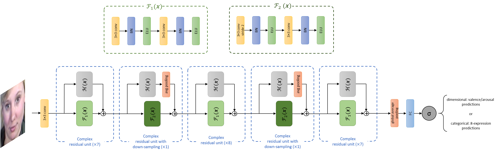

# BReG-NeXt
Implementation of the paper **BReG-NeXt: Facial Affect Computing Using Adaptive Residual Networks With Bounded Gradient**


BReG-NeXt paper can be found on 
[IEEE Xplore](https://ieeexplore.ieee.org/document/9064942) and
[arXiv](https://arxiv.org/abs/2004.08495)



# Requirements

Tensorflow 1.14.0 is suggested to run the code. For installing the rest of the required packages, run the following command:
```
pip install -r requirements.txt
```
# Content
* tfrecords: Sample tfrecords for training and validation from FER2013 database
* Snapshots: Example model trained on AffectNet database on BReG-NeXt-50
* Logs: Log report of the BReG-NeXt-50 trained model on AffectNet database

# Pre-Trained Parameters
As mentioned above trained parameters on the AffectNet database on BReG-NeXt-50 is provided in the [Snapshots folder](https://github.com/behzadhsni/BReG-NeXt/tree/master/codes/Snapshots/categorical_attempt_1). You can find various trained parameter values in this file. More specifically, the adaptive coefficient (alpha and beta) are stored in variables that have the following regex:

```
ResidualBlock[_]*[1-9]*/shortcut_mod[_]*[1-9]*/[a,c][_]*[1-9]*
```

# How To Run
Simply run the `BReG-NeXt.py` file:
```
codes/>> python BReG-NeXt.py
```

# Try on binder or google colab

[](https://mybinder.org/v2/gh/psnegi/BReG-NeXt/master?filepath=codes%2FBReG_NeXt.ipynb)

[](https://colab.research.google.com/github/psnegi/BReG-NeXt/blob/master/codes/BReG_NeXt.ipynb)

# Write Your Own Complex Mapping
To write your own customized complex mapping (given the restrictions and properties mentioned in the [BReG-NeXt paper](https://ieeexplore.ieee.org/document/9064942)), you need to modify [Lines 136 to 140](https://github.com/behzadhsni/BReG-NeXt/blob/master/codes/BReG-NeXt.py#L136) of the ```BReG-NeXt.py``` file. Simply write your own function for the mapping and assign it to the ```identity``` variable.

```
 with tf.name_scope('shortcut_mod'): # Write your customized function
  multiplier1 = tf.Variable(1, dtype=tf.float32, trainable=True, name='alpha') # first optional coefficient
  multiplier2 = tf.Variable(1, dtype=tf.float32, trainable=True, name='beta') # second optional coefficient
  with tf.name_scope('shortcut_mod_function'): 
    identity = your_function(multiplier1, multiplier2) # must assign your function to the 'identity' variable
```

# Citation
All submitted papers (or any publically available text) that uses the entire or parts of this code, must cite the following paper:

**B. Hasani, P. S. Negi and M. Mahoor, "BReG-NeXt: Facial affect computing using adaptive residual networks with bounded gradient," in IEEE Transactions on Affective Computing, 2020.**

BibTex:

```
@ARTICLE{9064942,  author={B. {Hasani} and P. S. {Negi} and M. {Mahoor}},  journal={IEEE Transactions on Affective Computing},  title={BReG-NeXt: Facial affect computing using adaptive residual networks with bounded gradient},   year={2020},  volume={},  number={},  pages={1-1},}
```
